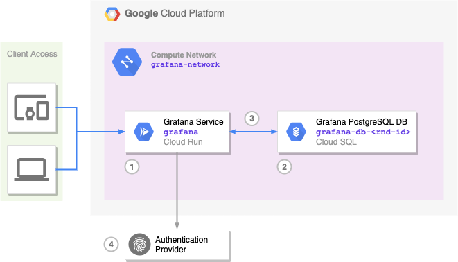

# Grafana on Google Cloud Run

This repository contains terraform configuration to setup a Grafana service on Google Cloud Run using Google Cloud SQL as database.

### Infrastructure

  

1. Grafana 6 is launched on Google Cloud Run from the Google custom image `marketplace.gcr.io/google/grafana6`.
2. Settings, users, dashboards and other types of data used by Grafana is persisted in a PostgreSQL database hosted on Google Cloud SQL.
3. Grafana service on Cloud Run communicates to the database through a serverless VPC adapter that allows the Cloud Run deployment to access a private cloud network where the DB is exposing its private IP. This ensures secure communication between the two services.
4. Users can access Grafana either through simple username/password or by proxying authentication through a third-party provider (e.g. Google, GitHub).
